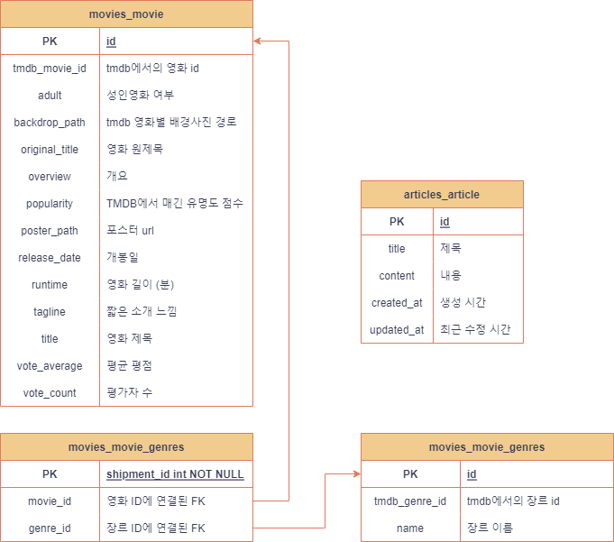

<br><br><br>
# 인기 영화 추천 사이트 (넷플릭스 컨셉)

<br>

## 프로젝트 소개
- 유명 영화 추천 사이트 구성하기
  - 사용자에게 TMDB에서 제공하는 최신 유명 영화들을 원하는 장르별로 보여주고, 상세 정보를 제공
  - [나무위키](https://namu.wiki/w/%EB%82%98%EB%AC%B4%EC%9C%84%ED%82%A4:%EB%8C%80%EB%AC%B8)에서 착안, 집단지성으로 로그인하지 않더라도 누구나 영화를 포함한 자유주제로 글을 작성하고 수정할 수 있는 커뮤니티 페이지 구성
- [Netflix](https://www.netflix.com/) 클론코딩

<br>

by 류나연, 조현기 <br>
진행 방식 : 역할을 따로 구분하지 않고, 그때그때 필요한 기능들을 함께 구현

<br>


<br>

### 개발 환경
- Django REST Framework & Vue 2

- 백엔드 서버 구동 방법
  1. final-pjt-back/ 디렉토리에서 파이썬 가상환경 설치하기 <br>
    ```bash
    $ python -m venv venv
    $ pip install -r requirements.txt
    ```
  2. Django 서버 구동하기
    ```bash
    $ python manage.py runserver
    ```

- 현재 DB가 기본적으로 들어있지만, 새로운 데이터로 업데이트 하고 싶다면, 기존 DB와 migration들을 지우고, 다음 코드들을 실행하기
  ```bash
    $ python manage.py makemigrations
    $ python manage.py migrate

    $ python manage.py runserver
  ```
- 그리고 데이터들을 불러오는 요청 실행하기
  - movies앱에 genre_update로 요청을 보낸 후 movie_update 요청 보내기

<br>

- 프론트엔드 서버 구동 방법 <br>
  1. final-pjt-front/front_server/ 디렉토리로 이동
  2. 필요한 패키지들 설치하기
  ```bash
    $ npm install
  ```
  3. vue 서버 실행
  ```bash
    $ npm run serve
  ```

<br>

### Entity Relationship Diagram (ERD)



<br><br>

### 기능 소개

- 메인 페이지
  - 전체 인기 영화, 혹은 사용자가 원하는 장르의 인기 영화들을 직접 넘겨보고 고를 수 있도록 Carousel로 구성
  - 인기 영화는 TMDB에서 제공하는 popularity 점수를 기반으로 선정
  
  - 영화 포스터를 클릭하면, 영화의 상세 정보를 볼 수 있도록 구성
  - 단, 드래그 시에는 상세 정보로 이동하지 않고, Carousel의 slide를 넘기도록 구현
  
  - 각 Carousel 별로 우측 상단의 이거 어때? 버튼을 클릭하면 해당하는 분야의 랜덤 영화를 사용자에게 추천하는 modal 팝업
  - 마찬가지로 포스터를 클릭하면, 해당 영화의 상세 정보 페이지로 이동
  - modal 외부를 클릭하면 modal 사라짐
  

<br>

- 커뮤니티 페이지 : 나무비위키
  - 로그인 여부에 관계 없이 누구나 영화, 또는 다양한 주제에 대한 글을 작성, 수정, 삭제할 수 있도록 구성
  - 나무위키에서 착안, 사람들의 집단지성이 커뮤니티를 형성하길 기대
  
  - 우측 상단에 파란색 게시글 작성 버튼을 누르면 게시글 작성 가능
  - 단, 빈 제목 혹은 빈 내용은 입력 불가능
  - 게시글을 누르면 게시글 상세 페이지로 이동 가능
  
  
  - 게시글 상세 페이지에서는, 게시글 수정, 삭제, 뒤로가기 가능
  


  ### 후기

  - 좋은 팀원을 만나서 진행하는 내내 재밌었습니다.